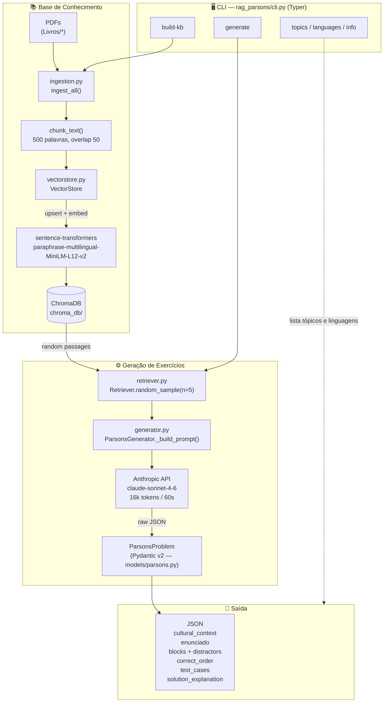

# Content aggregator rss

A command-line interface that aggregates food-related content by retrieving recipes and articles from online RSS feeds and dynamically displaying results based on a user-defined search keyword.

---




## 📌 Overview

This project is a Node.js command-line application that continuously fetches data from multiple food-related RSS feeds, filters the content according to a keyword provided by the user, and displays the aggregated results in a dynamic table.

The application updates automatically at a fixed interval and also allows the user to manually add custom items to the feed.

---

## ✨ Features

* Aggregates content from multiple RSS feeds
* Filters articles and recipes by a search keyword
* Dynamically updates content every 2 seconds
* Displays results in a tabular CLI format
* Allows users to add custom feed items manually
* Shows last update timestamp

---

## 🛠️ Technologies Used

* **Node.js** (ES Modules)
* **rss-parser** – for fetching and parsing RSS feeds
* **prompt-sync** – for synchronous user input in the terminal

---


## 🚀 How to use

1. Clone the repository and acess the folder:

```bash
git clone https://github.com/luiggyAlves/content-aggregator-rss
cd content-aggregator-rss
```

2. Install dependencies:

```bash
npm install
```

---

## ▶️ Usage

Run the application using Node.js:

```bash
node index
```

### User Flow

1. Enter a **search keyword** when prompted.
2. The application fetches RSS feeds and filters content based on the keyword.
3. Results are displayed in a table and refreshed every 2 seconds.
4. You may add custom items at any time using the format:

```
Title, https://example.com
```

---

## ⚙️ How It Works

### 1. RSS Fetching

The application uses `rss-parser` to asynchronously fetch multiple RSS feed URLs in parallel using `Promise.all`.

### 2. Aggregation Logic

* Extracts `title` and `link` from each RSS item
* Filters items whose titles include the user-defined keyword (case-insensitive)
* Stores matching results in a unified list

### 3. Dynamic Updates

A `setInterval` function triggers feed fetching every **2000 milliseconds**, ensuring the displayed content is always up to date.

### 4. Custom Items

Users can manually add custom feed entries, which persist across updates and are merged with fetched RSS items.

---

## 🧪 Example Output

```
┌─────────┬──────────────────────────────┬──────────────────────────────┐
│ (index) │            title             │             link             │
├─────────┼──────────────────────────────┼──────────────────────────────┤
│    0    │  Easy Homemade Pizza Dough   │  https://example.com/pizza   │
│    1    │  Healthy Breakfast Ideas     │  https://example.com/food    │
└─────────┴──────────────────────────────┴──────────────────────────────┘
Updated: Mon, 20 Jan 2026 14:30:00 GMT
```

---

## 📦 Dependencies

```json
"dependencies": {
  "prompt-sync": "^4.2.0",
  "rss-parser": "^3.13.0"
}
```

---
## 👨‍💻 Author: Luiggy Alves
- Computer Science student at the Federal University of Amazonas
- Project developed as part of the challenges proposed in the book “Learn Node.js with Real Projects” by Jonathan Wexler.

